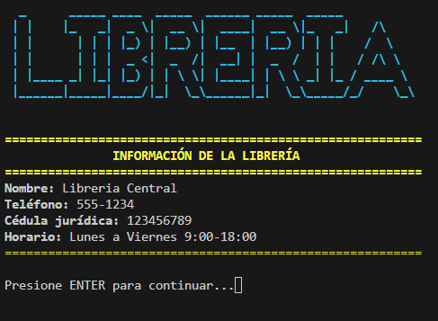

# Gestión Librería

[](https://github.com/Geovanni-Gonzalez/GestionLibreria/actions/workflows/ci.yml)

## Descripción
Sistema de gestión de librería en C con módulos para libros, clientes, pedidos, estadísticas, configuración e interfaz.

## Objetivo
Practicar programación modular en C, manejo de archivos y sistema administrativo por entidades.

## Tecnologías utilizadas
- C
- Makefile
- cJSON
- Archivos .txt/.json

## Funcionalidades principales
- Gestión de libros, clientes y pedidos
- Módulo de estadísticas
- Admin en JSON
- Interfaz de consola

## Mi rol
Implementé módulos, estructuras de datos y operaciones de archivo.

## Aprendizajes clave
- C modular
- Headers
- Archivos y JSON
- Makefile

## Instalación y ejecución
```bash
cd GestionLibreria/programa
make
./libreria
```
En Windows, el Makefile genera `libreria.exe`.

## Estructura del proyecto
- programa/*.c: módulos
- programa/include/: headers
- programa/data/: datos
- programa/Makefile: build

## Capturas o demo


## Estado del proyecto
Proyecto académico funcional.

## Valor técnico demostrado
Evidencia dominio de C modular y sistemas CRUD en consola.

## Mejoras futuras
- Documentar admin
- Agregar pruebas
- Normalizar salida de build

## Autor
Geovanni González  
Estudiante de Ingeniería en Computación  
GitHub: [Geovanni-Gonzalez](https://github.com/Geovanni-Gonzalez)


